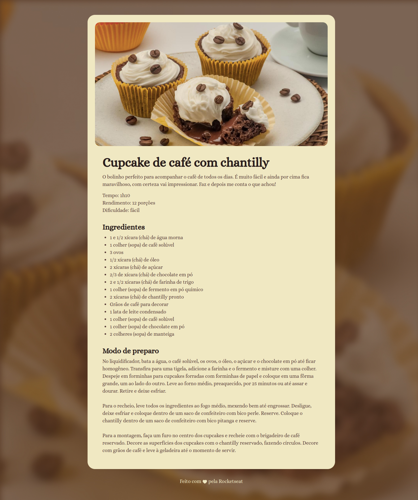

# Página de receita: Cupcake de café com chantilly

> Formação Full-Stack: Iniciando o HTML e CSS

O projeto é uma simples página de receita ensinando a fazer cupcake de café com chantilly.

[🔗 Clique aqui para acessar](https://fel1324.github.io/PaginaReceita/)

## 🛠️ Tecnologias

- HTML
- CSS
- Git e Github

## 💚 Contato

rafael.roberto200618@gmail.com

---

Feito com ♥ by Rocketseat :wave: [Participe da nossa comunidade!](https://discord.gg/rocketseat)